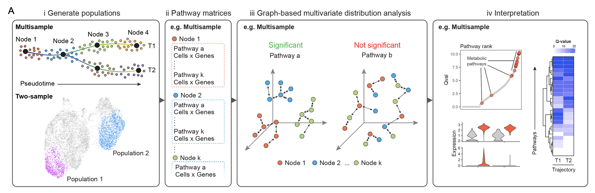

<!-- README.md is generated from README.Rmd. Please edit that file -->

```{r, include = FALSE}
knitr::opts_chunk$set(
  collapse = TRUE,
  comment = "#>",
  fig.path = "man/figures/",
  out.width = "100%"
)
```

# Single Cell Pathway Analysis (SCPA)

<!-- badges: start -->
<!-- badges: end -->



## About SCPA
SCPA is a method for pathway analysis in single cell RNA-seq data. It's based on a novel approach to pathway analysis that defines pathway activity as a change in multivariate distribution of a given pathway across conditions, rather than enrichment or over representation of genes. This approach allows for a number of benefits over current methods, including:

1. You will identify pathways that show enrichment in a given population AND also identify pathways with no overall enrichment but alterations in the multivariate distribution of that pathway. You essentially get the best of both worlds, as pathways with changes in multivariate distribution but no overall enrichment are still interestingly different pathways.

1. You can compare multiple conditions simultaneously e.g. compare across 3 time points, or across multiple phases of a pseuodotime trajectory. This means you can assess pathway activity through multiple stimulation times, or across cell differentiation

To see the stats behind SCPA, you can see our paper in JASA [here](https://www.tandfonline.com/doi/full/10.1080/01621459.2020.1791131)
To see SCPA applied to a scRNA-seq dataset, you can see our paper on bioRxiv [here]()

## 1. Installation

You can install the development version of SCPA from [GitHub](https://github.com/) with:

``` r
# install.packages("devtools")
devtools::install_github("jackbibby1/SCPA")
```

## 2. Tutorials
For tutorials on how to use SCPA, [click this link](jackbibby1.github.io/SCPA)

## 3. Issues

To report any issues or submit comments: https://github.com/jackbibby1/SCPA/issues


