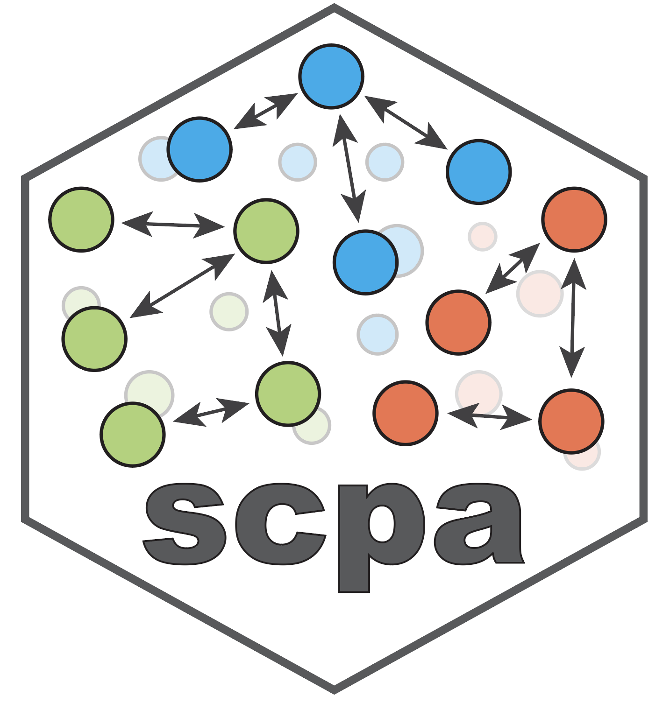

<!-- README.md is generated from README.Rmd. Please edit that file -->
<!-- badges: start -->
<!-- badges: end -->

# Single Cell Pathway Analysis 


### On this page

1.  A brief [overview](https://jackbibby1.github.io/SCPA/#about-scpa) of
    SCPA
2.  Package
    [installation](https://jackbibby1.github.io/SCPA/#installation)
3.  Links to [tutorials](https://jackbibby1.github.io/SCPA/#tutorials)
4.  Submitting
    [issues/comments](https://jackbibby1.github.io/SCPA/#issues)

### About SCPA

SCPA is a method for pathway analysis in single cell RNA-seq data. It’s
a different approach to pathway analysis that defines pathway activity
as a change in multivariate distribution of a given pathway across
conditions, rather than enrichment or over representation of genes.

Overall the workflow looks like this: generate the populations and
pathways to compare \> SCPA generates pathway specific expression
matrices for all comparisons \> SCPA performs graph based multivariate
distribution analysis across all pathways and populations \> SCPA
generates a Qval for plotting and ranking of pathway.

This approach allows for a number of benefits over current methods,
including:

1.  You will identify pathways that show enrichment in a given
    population AND also identify pathways with no overall enrichment but
    alterations in the multivariate distribution of that pathway. You
    essentially get the best of both worlds, as pathways with changes in
    multivariate distribution (high qval) but no overall enrichment (low
    fold change) are still interestingly different pathways, as we show
    in [our
    paper](https://www.biorxiv.org/content/10.1101/2022.02.07.478807v1)

2.  SCPA allows for multisample testing, so you can compare multiple
    conditions simultaneously e.g. compare across 3 time points, or
    across multiple phases of a [pseuodotime
    trajectory](https://jackbibby1.github.io/SCPA/articles/pseudotime.html).
    This means you can assess pathway activity through multiple
    stimulation phases, or across cell differentiation

To see the stats behind SCPA, you can see our paper in JASA
[here](https://www.tandfonline.com/doi/full/10.1080/01621459.2020.1791131)

Our paper introducing SCPA and demonstrating its use on a T cell
scRNA-seq dataset is currently on bioRxiv
[here](https://www.biorxiv.org/content/10.1101/2022.02.07.478807v1)

### Installation

You can install SCPA by running:

``` r
# install.packages("devtools")
devtools::install_version("crossmatch", version = "1.3.1", repos = "http://cran.us.r-project.org")
devtools::install_version("multicross", version = "2.1.0", repos = "http://cran.us.r-project.org")
devtools::install_github("jackbibby1/SCPA")
```

### Tutorials

If you’re viewing this page on GitHub, the SCPA webpage with all the
documentation and tutorials is
[here](https://jackbibby1.github.io/SCPA/)

We have various examples and walkthroughs, including:

-   A generic quick start
    [tutorial](https://jackbibby1.github.io/SCPA/articles/quick_start.html)
-   A
    [tutorial](https://jackbibby1.github.io/SCPA/articles/using_gene_sets.html)
    on how to get and use gene sets with SCPA
-   A
    [tutorial](https://jackbibby1.github.io/SCPA/articles/comparing_two_populations.html)
    for more detailed two group comparison with a specific data set
-   A
    [tutorial](https://jackbibby1.github.io/SCPA/articles/seurat_comparison.html)
    on how to use SCPA directly within a Seurat or SingleCellExperiment
    object
-   A
    [tutorial](https://jackbibby1.github.io/SCPA/articles/visualisation.html)
    on visualising SCPA output
-   A
    [tutorial](https://jackbibby1.github.io/SCPA/articles/pseudotime.html)
    for multisample SCPA, comparing pathways across a pseudotime
    trajectory
-   A
    [tutorial](https://jackbibby1.github.io/SCPA/articles/systematic_tissue_comparison.html)
    of a systematic analysis of many cell types across multiple tissues
-   A
    [tutorial](https://jackbibby1.github.io/SCPA/articles/disease_comparison.html)
    for a systems level analysis of many cells types in disease
    (COVID-19)

### Issues

To report any issues or submit comments please use:
<https://github.com/jackbibby1/SCPA/issues>
