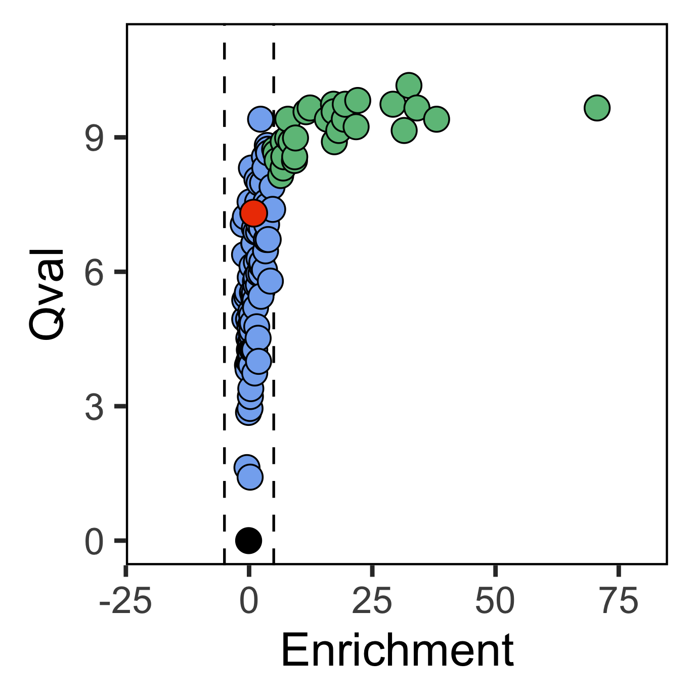

```{r, include = FALSE}
knitr::opts_chunk$set(
  collapse = TRUE,
  comment = "#>"
)
```

Let's load in a couple of packages
```{r setup, warning=F, message=F, results='hide', eval=F}
library(SCPA)
library(Seurat)
library(tidyverse)
```

Here we'll look at replicating some data in our recent paper. In the paper, we took resting naive CD4+ T cells at 0hr, and compared metabolic pathways to activated naive CD4+ T cells at 24hr. Let's first load in the data we're going to use

```{r load_data, echo=F, eval=F}
load("~/Google Drive/scRNA_metabolism_paper/Processing scRNAseq data/Naive CD4/int_data_N4.RData")
naive_cd4 <- int_data_N4
rm(int_data_N4)
```

```{r, eval=F}
load("naive_cd4.RData")
```


In the `naive_cd4` object, we have all our naive CD4 T cells with metadata specifying the identified cell types and the hour specifying time point of cell harvesting.

```{r draw_umap, eval=F}
DimPlot(naive_cd4, split.by = "Hour") +
  theme(aspect.ratio = 1)
```

{width=100%}

We then need the expression matrices for the populations we want to compare. For this, we can use the `seurat_extract` function from the SCPA package, which takes a Seurat object and subsets the data based on the metadata specified in the Seurat columns e.g. here we want to take 'Resting' cells at 0hr, and 'Activated' cells at 24hr.

```{r seurat_extract, eval=F}
resting <- seurat_extract(naive_cd4,
                          meta1 = "Cell_Type", value_meta1 = "Resting",
                          meta2 = "Hour", value_meta2 = 0)

activated <- seurat_extract(naive_cd4,
                            meta1 = "Cell_Type", value_meta1 = "Activated",
                            meta2 = "Hour", value_meta2 = 24)

```


After we have our data, we can define the pathways to compare. For the Fig 4 analysis, we curated a list of metabolic pathways from a few different sources, which can be found here. The file is in standard gmt file format with pathway name in column 1 and genes of that pathway in subsequent columns. Here we just converted a gmt file to csv, and manually curated a single file with all metabolic gene sets. SCPA just needs the filepath to these gene sets, so we can add this as an object to simplify our final chunk of code

```{r get_pathways, echo=F, eval=F}
pathways <- "~/Google Drive/scRNA_metabolism_paper/Pathways_and_gene_sets/combined_metab/Combined_metab_paths_noGO.csv"
```


```{r, eval=F}
pathways <- "combined_metabolic_pathways.csv"
```

So now we have our samples and metabolic gene sets. To compare these pathways, we can just run the compare_pathways function. NB, the samples need to be supplied as a list

```{r compare_pathways, eval=F}
rest_act <- compare_pathways(samples = list(resting, activated), 
                             pathways = pathways)
```

```{r, echo=F, eval=F}
rest_act <- readRDS("~/Google Drive/scRNA_metabolism_paper/Paper/Fig4/rest_act.rds")
```

Now we have the results stored in the rest_act object, which we can then visualize. In the paper, we present the data as a classical volcano plot where the q value (SCPA statistic) is plotted against fold change of each pathway. We just need to do some formatting before plotting the data.

```{r plot_volcano, eval=F}
rest_act$FC <- -rest_act$FC
rest_act <- rest_act %>%
  mutate(color = case_when(FC > 5 & adjPval < 0.01 ~ '#6dbf88',
                           FC < 5 & FC > -5 & adjPval < 0.01 ~ '#84b0f0',
                           FC < -5 & adjPval < 0.01 ~ 'seagreen2',
                           FC < 5 & FC > -5 & adjPval > 0.01 ~ 'black'))

aa_path <- rest_act %>% 
  filter(grepl(pattern = "reactomeome_arachi", ignore.case = T, x = Pathway))

rest_act %>% arrange(desc(qval)) %>% filter(color == "#84b0f0")

ggplot(rest_act, aes(FC, qval)) +
  geom_vline(xintercept = c(-5, 5), linetype = "dashed", col = 'black', lwd = 0.3) +
  geom_point(cex = 2.6, shape = 21, fill = rest_act$color, stroke = 0.3) +
  geom_point(data = aa_path, shape = 21, cex = 2.8, fill = "orangered2", color = "black", stroke = 0.3) +
  xlim(-20, 80) +
  ylim(0, 11) +
  xlab("Enrichment") +
  ylab("Qval") +
  theme(panel.background = element_blank(),
        panel.border = element_rect(fill = NA),
        aspect.ratio = 1)
```

{width=45%}


