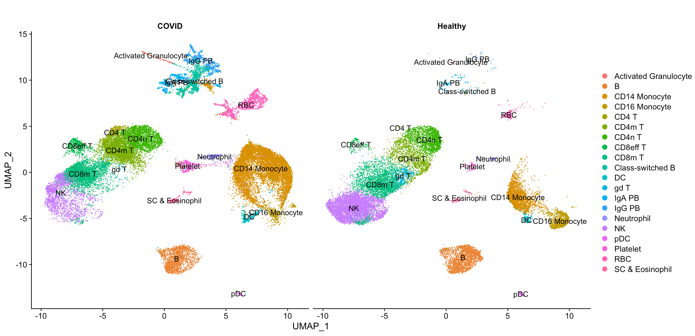

```{r, include = FALSE}
knitr::opts_chunk$set(
  collapse = TRUE,
  comment = "#>"
)
```

Here we're going to perform a systems level characterisation of pathway perturbations in a disease. Applying a systems level analysis of a disease using scRNA-seq data allows you to get a really good understanding of a few important aspects:

- Which pathways show the greatest perturbation in the disease
- Which cell types show the largest perturbation in their transcriptional profile
- Shared and unique pathway perturbations across cell types

Because SCPA can be easily applied in a systems level way, it allows for the identification of the most relevant pathways and cell types in any given disease.

## Loading in data/packages
Let's load in a few packages

```{r setup, eval=F}
library(SCPA)
library(Seurat)
library(tidyverse)
library(ComplexHeatmap)
library(circlize)
```

And load in a dataset from [Wilk, A...Blish, C](https://www.nature.com/articles/s41591-020-0944-y) that creates a single cell atlas of peripheral blood immune cells in COVID-19 patients.

```{r, eval=F}
blood_atlas <- readRDS("covid_blood_atlas.rds")
Idents(blood_atlas) <- blood_atlas$cell.type
```

Let's have a quick look at the data, and get rid of any cell populations that aren't represented in both healthy and disease datasets.

```{r, eval=F}
DimPlot(blood_atlas, label = T, group.by = "cell.type.fine", split.by = "Status") +
  theme(aspect.ratio = 1)
```

{width=100%}

```{r, eval=F}
idents <- c("Class-switched B", "IgG PB", "IgA PB", "CD14 Monocyte", "CD8m T",
            "CD4m T", "CD4n T", "B", "NK", "Neutrophil", "CD16 Monocyte", "gd T",
            "pDC", "SC & Eosinophil", "DC")
blish_sub <- subset(blish, idents = idents)
```


## Preparing data for comparison
Now we can pull all of the pathways that we want to compare. For this, we're using a csv file that contains a combination of canonical pathways, gene ontology pathways, and regulatory pathways from [MSigDB](https://www.gsea-msigdb.org/gsea/msigdb), and you can find this file [here](https://github.com/jackbibby1/SCPA/blob/main/gene_sets/).

```{r, eval=F}
pathways <- "h_k_r_go_pid_reg_wik.csv"
```

And let's create an object with our cell types that we want to compare, and split the object by disease status.

```{r, eval=F}
cell_types <- unique(blood_atlas$cell.type.fine)
blood_atlas <- SplitObject(blood_atlas, split.by = "Status")
```

## SCPA comparison
Now we've formatted everything properly, we just need to loop SCPA over all the cell types in the dataset. Here we're using `seurat_extract` to pull expression matrices from each cell type, and then using these as the input to `compare_pathways`. We're using a load of pathways and cell types here, so this may take a while. We're also just going to keep the Pathway and qval variables from each comparison, and add the cell type to the column names, so we can keep track of the qvals for each cell type.

```{r, eval=F}
scpa_out <- list()
for (i in cell_types) {
  
  healthy <- seurat_extract(blood_atlas$Healthy, 
                            meta1 = "cell.type.fine", value_meta1 = i)
  
  covid <- seurat_extract(blood_atlas$COVID, 
                          meta1 = "cell.type.fine", value_meta1 = i)
  
  print(paste("comparing", i))
  scpa_out[[i]] <- compare_pathways(list(healthy, covid), pathways) %>%
    select(Pathway, qval) %>%
    set_colnames(c("Pathway", paste(i, "qval", sep = "_")))
  
}
```

## Plotting the output
```{r, echo=F}
load("~/Google Drive/scRNA_metabolism_paper/Paper/Fig6/Disease_data/Tilo_COVID/mcross_bloodatlas_10k_gene_sets.RData")
scpa_out <- mcross_blood_atlas
```

<details>
  <summary>**Click here for the data wrangling for plotting**</summary>

Let's combine the results from all cell types, and just take pathways with a qval of > 2 in any comparison
```{r, eval=F}
scpa_out <- scpa_out %>% 
  reduce(full_join, by = "Pathway") %>% 
  set_colnames(gsub(colnames(.), pattern = " ", replacement = "_")) %>%
  select(c("Pathway", grep("_qval", colnames(.)))) %>%
  filter_all(any_vars(. > 2)) %>%
  column_to_rownames("Pathway")
```

We can then take pathways that we want to highlight in the final plot
```{r, eval=F}
blood_paths <- c("HALLMARK_TNFA_SIGNALING_VIA_NFKB", "HALLMARK_INFLAMMATORY_RESPONSE",
                 "HALLMARK_COMPLEMENT", "HALLMARK_IL6_JAK_STAT3_SIGNALING",
                 "HALLMARK_IL2_STAT5_SIGNALING", "HALLMARK_INTERFERON_GAMMA_RESPONSE",
                 "HALLMARK_MTORC1_SIGNALING", "HALLMARK_INTERFERON_ALPHA_RESPONSE",
                 "HALLMARK_MYC_TARGETS_V1", "HALLMARK_OXIDATIVE_PHOSPHORYLATION")
```

And create row annotations for the heatmap to highlight these pathways, and color scale
```{r, eval=F}
position <- which(rownames(scpa_out) %in% blood_paths)
row_an <- rowAnnotation(Genes = anno_mark(at = which(rownames(scpa_out) %in% blood_paths),
                                          labels = rownames(scpa_out)[position],
                                          labels_gp = gpar(fontsize = 7),
                                          link_width = unit(2.5, "mm"),
                                          padding = unit(1, "mm"),
                                          link_gp = gpar(lwd = 0.5)))
col_hm <- colorRamp2(colors = c("blue", "white", "red"), breaks = c(0, 3, 6))
```

</details>
\

Now we have all the results, we can plot a heatmap of the qvals to get an idea of any broad patterns. Interestingly, we see a large dysregulation of pathways in CD14^+^ monocytes in the peripheral blood of COVID-19 patients, suggesting that these cell show the greatest deviation from CD14^+^ monocytes from healthy donors. These pathways include well defined immunologcal signatures in response to viral infection, including interferon response pathways, and complement cascades. We've just chosen to highlight a few on the heatmap below.

```{r, eval=F}
Heatmap(scpa_out,
        col = col_hm,
        name = "Qval",
        show_row_names = F,
        #right_annotation = row_an,
        column_names_gp = gpar(fontsize = 8),
        border = T,
        column_km = 3,
        row_km = 3,
        column_labels = c("CS B", "IgG B", "IgA B", "CD14 Mono", "mCD8 T", "mCD4 T",
                          "nCD4 T", "B", "NK", "Neut", "CD16 Mono", "gdT", "pDC", "Eosin", "DC"))
```

{width=75%}


