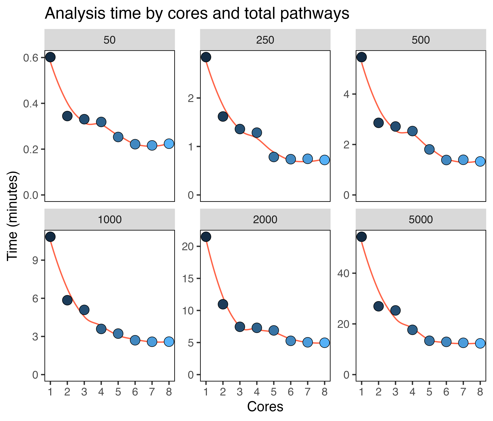

```{r, include = FALSE}
knitr::opts_chunk$set(
  collapse = TRUE,
  comment = "#>"
)
```

Version 1.5 added parallel implementation in the `compare_pathways()` function, which will significantly reduce the time taken for pathway comparisons. Users can specify this with `parallel = TRUE` and `cores = x`.
Here are some benchmarking figures for varying numbers of cores (1-8) and pathways (50-5000) using the default 500 cells
per population. You can see that using somewhere between 2-4 cores scales well, showing large improvements in completion speed.

<details>
  <summary>**Click here for the benchmarking code**</summary>

```{r setup, eval=F}
library(SCPA)
library(msigdbr)
library(Seurat)
library(magrittr)
library(ggplot2)

df <- readRDS("naive_cd4.rds")

pathways <- msigdbr("Homo sapiens", "H") %>%
  format_pathways()

p1 <- seurat_extract(df, meta1 = "Hour", value_meta1 = "0")
p2 <- seurat_extract(df, meta1 = "Hour", value_meta1 = "12")

cores_to_use <- seq(1, 8, 1)
gene_set_multiplier <- c(1, 5, 10, 20, 40, 100)

two_sample_times <- list()
for (i in gene_set_multiplier) {
  two_sample_times[[as.character(i)]] <- lapply(cores_to_use, function(x) {
    system.time(compare_pathways_parallel(samples = list(p1, p2), pathways = rep(pathways, i), cores = x, downsample = 100))
  })
}

two_sample_times %>%
  lapply(function(x) lapply(x, function(c) c[3])) %>%
  unlist() %>%
  data.frame() %>%
  rename(time = ".") %>%
  mutate(time = time/60) %>%
  mutate(cores = rep(cores_to_use, times = 6)) %>%
  mutate(pathway_size = rep(50*(gene_set_multiplier), each = 8)) %>%
  ggplot(aes(cores, time)) +
  geom_smooth(se = F, col = "tomato", linewidth = 0.5) +
  facet_wrap(~pathway_size, scales = "free_y") +
  geom_point(shape = 21, size = 3.5, stroke = 0.3, aes(fill = cores)) +
  scale_y_continuous(limits = c(0, NA)) +
  scale_x_continuous(breaks = seq(1, 8, 1)) +
  labs(x = "Cores", y = "Time (minutes)", title = "Analysis time by cores and total pathways") +
  theme(panel.background = element_blank(),
        panel.border = element_rect(fill = NA),
        legend.position = "none")


```

</details>
\

{width=60%}

And here's some equivalent benchmarking using the multisample comparison across three populations:

<details>
  <summary>**Click here for the benchmarking code**</summary>
  
```{r, eval=F}
p3 <- seurat_extract(df, meta1 = "Hour", value_meta1 = "24")

cores_to_use <- seq(1, 8, 1)
gene_set_multiplier <- c(1, 5, 10, 20, 40, 100)

multisample_times <- list()
for (i in gene_set_multiplier) {
  multisample_times[[as.character(i)]] <- lapply(cores_to_use, function(x) {
    system.time(compare_pathways_parallel(samples = list(p1, p2, p3), pathways = rep(pathways, i), cores = x))
  })
}

df %>%
  lapply(function(x) lapply(x, function(c) c[3])) %>%
  unlist() %>%
  data.frame() %>%
  rename(time = ".") %>%
  mutate(time = time/60) %>%
  mutate(cores = rep(cores_to_use, times = 6)) %>%
  mutate(pathway_size = rep(50*(gene_set_multiplier), each = 8)) %>%
  ggplot(aes(cores, time)) +
  geom_smooth(se = F, col = "tomato", linewidth = 0.5) +
  facet_wrap(~pathway_size, scales = "free_y") +
  geom_point(shape = 21, size = 3.5, stroke = 0.3, aes(fill = cores)) +
  scale_y_continuous(limits = c(0, NA)) +
  scale_x_continuous(breaks = seq(1, 8, 1)) +
  labs(x = "Cores", y = "Time (minutes)", title = "Analysis time by cores and total pathways") +
  theme(panel.background = element_blank(),
        panel.border = element_rect(fill = NA),
        legend.position = "none")

```

</details>
\

{width=60%}


