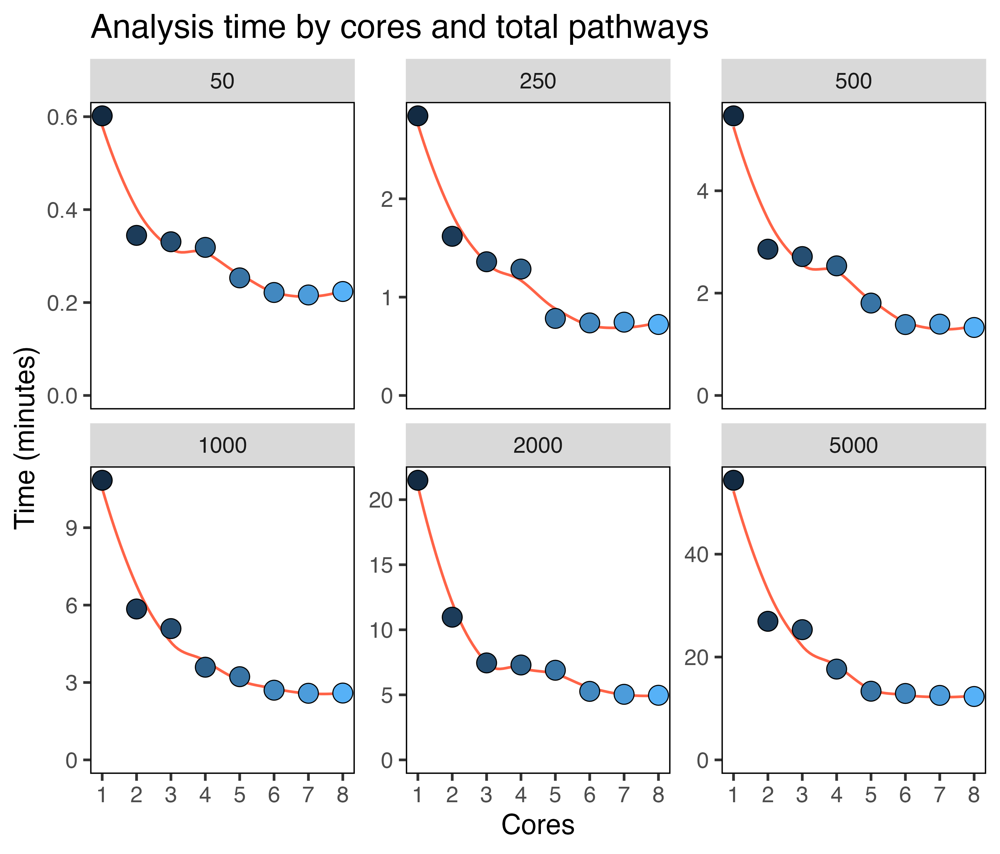

```{r, include = FALSE}
knitr::opts_chunk$set(
  collapse = TRUE,
  comment = "#>"
)
```

Version 1.4.1 added parallel implementation in the `compare_pathways()` function. 
Users can specify this with `parallel = TRUE` and `cores = x`, which will significantly reduce the time taken for pathway comparisons.
Here are some benchmarking figures for varying numbers of cores (1-4) using the default of 500 cells per population and
50 pathways.

```{r setup, eval=F}
library(SCPA)
library(msigdbr)
library(Seurat)
library(magrittr)
library(ggplot2)

df <- readRDS("naive_cd4.rds")

pathways <- msigdbr("Homo sapiens", "H") %>%
  format_pathways()

p1 <- seurat_extract(df, meta1 = "Hour", value_meta1 = "0")
p2 <- seurat_extract(df, meta1 = "Hour", value_meta1 = "12")

cores_to_use <- seq(1, 4, 1)
 two_sample_times <- lapply(cores_to_use, function(x) {
   system.time(compare_pathways(samples = list(p1, p2), 
                                pathways = pathways, 
                                parallel = TRUE,
                                cores = x))
 })

data.frame(cores = cores_to_use,
           time = sapply(two_sample_times, function(x) x[3])) %>%
  ggplot(aes(cores, time)) +
  geom_line() +
  geom_point(shape = 21, size = 3.5, aes(fill = cores)) +
  scale_y_continuous(limits = c(0, NA)) +
  labs(x = "Cores", y = "Time (seconds)", title = "2 sample comparison") +
  theme(panel.background = element_blank(),
        panel.border = element_rect(fill = NA),
        legend.position = "none")


```

{width=30%}

And here's some equivalent benchmarking using the multisample comparison across three populations:

```{r, eval=F}
p3 <- seurat_extract(df, meta1 = "Hour", value_meta1 = "24")

cores_to_use <- seq(1, 4, 1)
 multisample_times <- lapply(cores_to_use, function(x) {
   system.time(compare_pathways(samples = list(p1, p2, p3), 
                                pathways = pathways, 
                                parallel = TRUE,
                                cores = x))
 })

data.frame(cores = cores_to_use,
           time = sapply(multisample_times, function(x) x[3])) %>%
  ggplot(aes(cores, time)) +
  geom_line() +
  geom_point(shape = 21, size = 3.5, aes(fill = cores)) +
  scale_y_continuous(limits = c(0, NA)) +
  labs(x = "Cores", y = "Time (seconds)", title = "2 sample comparison") +
  theme(panel.background = element_blank(),
        panel.border = element_rect(fill = NA),
        legend.position = "none")

```

{width=30%}


