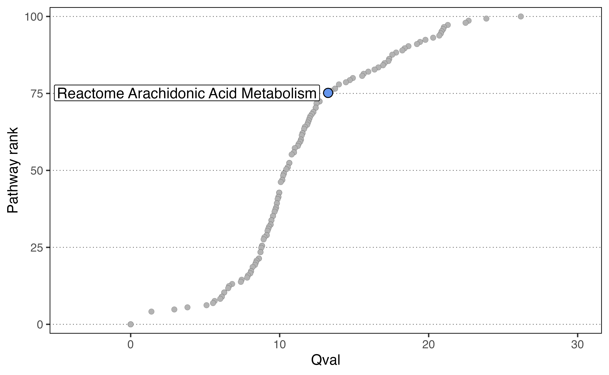

```{r, include = FALSE}
knitr::opts_chunk$set(
  collapse = TRUE,
  comment = "#>"
)
```

## Comparing pathways across pseudotime with SCPA

Here we're going to look at tracking gene set changes across a pseudotime trajectory.
To do this, we'll replicate some data from our [recent paper](link) where we characterised
the transcriptional reprogramming of metabolic pathways after activation.

Let's load in a few packages to start

```{r setup, results='hide', warning=FALSE, message=FALSE}
devtools::install_github("jackbibby1/SCPA")
library(SCPA)
library(Seurat)
library(dyno)
library(tidyverse)
library(magrittr)
library(ComplexHeatmap)
library(circlize)
```

And load in our data. This is taken from our naive CD4+ T cell dataset that you can access [here]()

```{r load_data}
load("~/Google Drive/scRNA_metabolism_paper/Processing scRNAseq data/Naive CD4/int_data_N4.RData")
naive_cd4 <- int_data_N4
rm(int_data_N4)
```

We can see that the populations include both naive/effector T cells, and Tregs
```{r plot_umap, eval=F}
DimPlot(naive_cd4, split.by = "Hour")
```
{width=100%}

Then we'll get rid of the Tregs because we're just interested in naive T cell activation in the non Treg populations

```{r remove_treg}
naive_cd4 <- subset(naive_cd4, idents = "Treg", invert = T)
```

We'll then take the top 1000 most variable genes to model a trajectory

```{r var_genes}
df <- as.matrix(naive_cd4[["RNA"]]@data)
var_genes <- names(sort(apply(df, 1, var), decreasing = TRUE))[1:1000]
```

And then these steps are broadly taken from the dyno website. We're just taking expression
data and adding it to the object so it's able to be used in the `infer_trajectory`
function.

```{r make_matrix}
counts <- Matrix::t(as(as.matrix(naive_cd4@assays$RNA@counts[var_genes,]), 'sparseMatrix'))
expression <- Matrix::t(as(as.matrix(naive_cd4@assays$RNA@data[var_genes,]), 'sparseMatrix'))

dataset_n4 <- wrap_expression(expression = expression,
                              counts = counts)
```

And finally running the `infer_trajectory` function using slingshot as the modeller
```{r run_modelling, eval=FALSE}
model_n4 <- infer_trajectory(dataset_n4, method = ti_slingshot(), verbose = T)
```

```{r load_n4_model, echo=F}
load("~/Google Drive/scRNA_metabolism_paper/Paper/Fig2/NaiveCD4_ti_slingshot_model_1000var_feat.RData")
```

We can visualise the trajectory

```{r plot_dimred, eval=F}
plot_dimred(model_n4, "pseudotime", pseudotime = calculate_pseudotime(model_n4), hex_cells = F,
            plot_trajectory = T, size_cells = 1, alpha_cells = 0.8) + 
  theme(aspect.ratio = 1)
```

{width=50%}

Once we have our trajectory calculated, we can generate distinct nodes of cells across the trajectory
to use as an input for SCPA. To generate the nodes, we can use the `group_onto_nearest_milestones` function, which assigns each cell to a node based on it's pseudotime value.

We can then visualize the nodes that are calculated across the trajectory.

```{r plot_dimred_milestones, eval=F}
plot_dimred(model_n4, grouping = group_onto_nearest_milestones(model_n4), hex_cells = F,
            plot_trajectory = T, size_cells = 1, alpha_cells = 0.8) + 
  theme(aspect.ratio = 1)
```

{width=50%}

And extract the cells based on this grouping

```{r get_milestones}
mile_group <- data.frame(group_onto_nearest_milestones(model_n4)) %>%
  set_colnames("milestone") %>%
  rownames_to_column("cell")
```

Once we have the pseudotime groupings, we can add this information to the Seurat
object. 

```{r add_milestones}
naive_cd4$milestone <- mile_group$milestone
```

We then need to extract expression matrices for all the cells across the distinct nodes,
so we effectively have 4 populations across the trajectory. We can use these expression
matrices to assess pathways across the 4 nodes.

We can use the `seurat_extract` function from the SCPA package to get expression matrices,
and use this within a for loop to get expression information for all cells in each population.

```{r seurat_extract}
cd4_pseudo <- list()
for (i in 1:4) {
  cd4_pseudo[[i]] <- seurat_extract(naive_cd4, meta1 = "milestone", value_meta1 = i)
}
```

Now all the hard work is done, we just need to give this information to SCPA to analyse
pathways over pseudotime, after defining the pathways

```{r compare_pathways, eval=F}
pathways <- "~/Google Drive/scRNA_metabolism_paper/Pathways_and_gene_sets/combined_metab/Combined_metab_paths_noGO.csv"

cd4_metabolism <- compare_pathways(cd4_pseudo, pathways)
```

```{r load_scpa_result, echo=F}
load("~/Google Drive/scRNA_metabolism_paper/Paper/mstone_out.RData")
cd4_metabolism <- mstone_out
```

All done. Let's plot the data (some annotations have been added later to highlight pathways, but we can see the final heatmap from Fig4B in [our paper]())

```{r plot_heatmap, eval=F}
cd4_metabolism <- cd4_metabolism %>%
  data.frame() %>%
  select(Pathway, qval) %>%
  column_to_rownames("Pathway")

col_hm <- colorRamp2(colors = c("white", "red"), breaks = c(0, max(mstone_out)))

Heatmap(t(cd4_metabolism),
        name = "Qvalue",
        col = col_hm,
        border = T,
        rect_gp = gpar(col = "white", lwd = 0.1),
        heatmap_height = unit(2, "cm"),
        show_column_dend = F,
        show_row_names = F,
        show_column_names = F)
```

{width=80%}

We can also extract a single pathway to highlight its rank in the analysis using the
`plot_rank` function:

```{r plot_rank, eval=F}
cd4_metabolism <- rownames_to_column(cd4_metabolism, "Pathway")
plot_rank(cd4_metabolism, 
          "reactome_arachidonic", 
          label_size = 2)
```

{width=80%}


