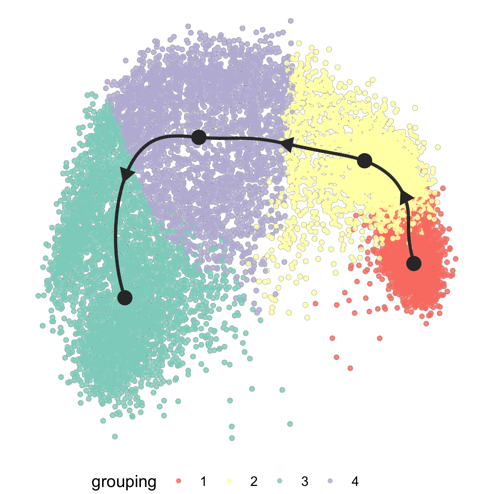

```{r, include = FALSE}
knitr::opts_chunk$set(
  collapse = TRUE,
  comment = "#>"
)
```

## Multisample analysis with SCPA
Multisample analysis can be performed with SCPA, meaning you can test pathway activity over multiple populations. This may be useful if you have multiple time points, or a pseudotime trajectory. The principle is the same as a two group comparison, but you just need to supply more populations. For example, if you have three time points, you would run:

```{r, eval=F}

scpa_out <- compare_pathways(samples = list(pop1, pop2, pop3),
                             pathways = pathways)

```

## Comparing pathways across pseudotime with SCPA

Here we're going to look at tracking gene set changes across a pseudotime trajectory, using the multisample capability of SCPA. To do this, we'll use a dataset that we generated where naive CD4^+^ T cells were left unstimulated, or stimuated for 12 or 24 hours with anti-CD3 and anti-CD28. You can find this dataset [here](https://drive.google.com/file/d/1XstWBD4lOY0QNd-8Wzeh1f3-uYKuUU5Q/view?usp=sharing). We'll do a systematic analysis of how metabolic pathways are transcriptionally regulated throughout naive CD4^+^ T cell activation.

Let's load in a few packages to start

```{r setup, eval=F}
library(SCPA)
library(Seurat)
library(tidyverse)
library(magrittr)
library(dyno)
library(ComplexHeatmap)
library(circlize)
```


### Load in data
```{r, eval=F}
naive_cd4 <- load("naive_cd4.rds")
```


### Quick look at the data
We can see that the populations include both naive/activated T cells, and Tregs
```{r plot_umap, eval=F}
DimPlot(naive_cd4, split.by = "Hour")
```
{width=100%}

### Filter out cells we don't want
We'll get rid of the Tregs because we're just interested in naive T cell activation in the non Treg populations

```{r remove_treg, eval=F}
naive_cd4 <- subset(naive_cd4, idents = "Treg", invert = T)
```


### Model trajectory using the dyno workflow
We'll then take the top 1000 most variable genes to model a trajectory
```{r var_genes, eval=F}
df <- as.matrix(naive_cd4[["RNA"]]@data)
var_genes <- names(sort(apply(df, 1, var), decreasing = TRUE))[1:1000]
```

And then these steps are broadly taken from the [dyno vignettes](https://dynverse.org/users/3-user-guide/). We're just taking expression data and adding it to the object so it's able to be used in the `infer_trajectory`
function.

```{r make_matrix, eval=F}
counts <- Matrix::t(as(as.matrix(naive_cd4@assays$RNA@counts[var_genes,]), 'sparseMatrix'))
expression <- Matrix::t(as(as.matrix(naive_cd4@assays$RNA@data[var_genes,]), 'sparseMatrix'))

dataset_n4 <- wrap_expression(expression = expression,
                              counts = counts)
```

And finally running the `infer_trajectory` function using slingshot as the modeller
```{r run_modelling, eval=FALSE}
model_n4 <- infer_trajectory(dataset_n4, method = ti_slingshot(), verbose = T)
```

We can visualise the trajectory

```{r plot_dimred, eval=F}
plot_dimred(model_n4, 
            "pseudotime", 
            pseudotime = calculate_pseudotime(model_n4), 
            hex_cells = F,
            plot_trajectory = T, 
            size_cells = 1, alpha_cells = 0.8) + 
  theme(aspect.ratio = 1)
```

{width=50%}


Once we have our trajectory calculated, we can generate distinct nodes of cells across the trajectory
to use as an input for SCPA. To generate the nodes, we can use the `group_onto_nearest_milestones` function, which assigns each cell to a node based on it's pseudotime value.

We can then visualize the nodes that are calculated across the trajectory to see what we're extracting

```{r plot_dimred_milestones, eval=F}
plot_dimred(model_n4, 
            grouping = group_onto_nearest_milestones(model_n4), 
            hex_cells = F,
            plot_trajectory = T, 
            size_cells = 1, alpha_cells = 0.8) + 
  theme(aspect.ratio = 1)
```

{width=50%}


And extract the cells based on this grouping

```{r get_milestones, eval=F}
mile_group <- data.frame(group_onto_nearest_milestones(model_n4)) %>%
  set_colnames("milestone") %>%
  rownames_to_column("cell")
```

Once we have the pseudotime groupings, we can add this information to the Seurat
object. 

```{r add_milestones, eval=F}
naive_cd4$milestone <- mile_group$milestone
```


### Extract expression data for the populations we're comparing
We then need to extract expression matrices for all the cells across the distinct nodes,
so we effectively have 4 populations across the trajectory. We can use these expression
matrices to assess pathways across the 4 nodes.

We can loop the `seurat_extract` function to get expression matrices for all cells in each population.

```{r seurat_extract, eval=F}
cd4_pseudo <- list()
for (i in 1:max(mile_group$milestone)) {
  cd4_pseudo[[i]] <- seurat_extract(naive_cd4, meta1 = "milestone", value_meta1 = i)
}
```

### Define pathways and run comparison
Now all the hard work is done, we just need to give this information to SCPA to analyse
pathways over pseudotime, after defining the pathways. Here we're using a curated list of metabolic
pathways taken from Hallmark, KEGG, and Reactome databases that you can find [here](https://github.com/jackbibby1/SCPA/blob/main/gene_sets/)

```{r compare_pathways, eval=F}
pathways <- "combined_metabolic_pathways.csv"

cd4_metabolism <- compare_pathways(samples = cd4_pseudo, 
                                   pathways = pathways)
```


### Plot a global summary of the data
All done. Let's plot the data (some annotations have been added later to highlight pathways)

```{r plot_heatmap, eval=F}
cd4_metabolism <- cd4_metabolism %>%
  data.frame() %>%
  select(Pathway, qval) %>%
  column_to_rownames("Pathway")

col_hm <- colorRamp2(colors = c("white", "red"), breaks = c(0, max(mstone_out)))

Heatmap(t(cd4_metabolism),
        name = "Qvalue",
        col = col_hm,
        border = T,
        rect_gp = gpar(col = "white", lwd = 0.1),
        heatmap_height = unit(2, "cm"),
        show_column_dend = F,
        show_row_names = F,
        show_column_names = F)
```

{width=70%}


### Highlight pathway by rank
We can also extract a single pathway to highlight its rank in the analysis using the
`plot_rank` function. There are lots of glycolysis pathways near the top of the list, 
but we'll just highlight one.

```{r plot_rank, eval=F}
plot_rank(scpa_out = cd4_metabolism, 
          pathway = "hallmark_gly",
          base_point_size = 2.5,
          highlight_point_size = 3)
```

{width=70%}


