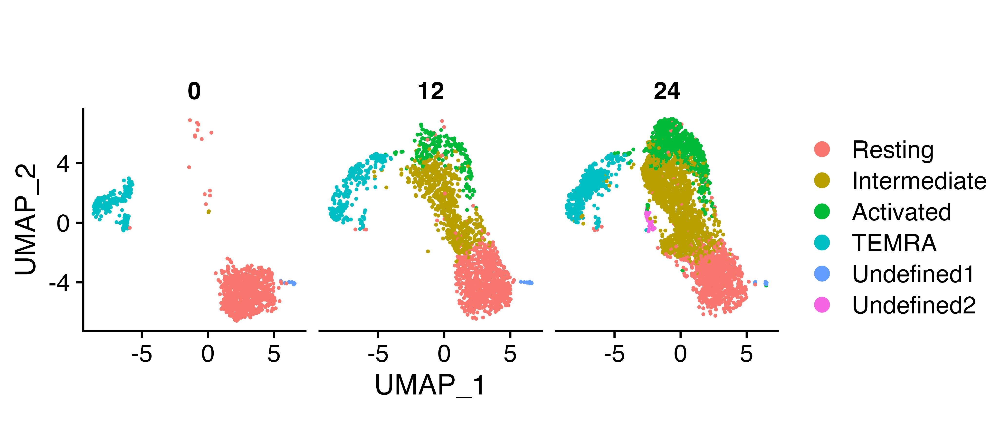

```{r, include = FALSE}
knitr::opts_chunk$set(
  collapse = TRUE,
  comment = "#>"
)
```

## 1. Broad overview of the workflow

```{r, eval=F}
pathways <- msigdbr("Homo sapiens") %>%
  format_pathways()

# The populations here just need to be your normalized expression matrices

scpa_out <- compare_pathways(samples = list(population1, population2),
                             pathways = pathways)

```

## 2. Full workflow on an example dataset

Here we're just going to show some general principles of what you need to get started in a basic pathway analysis. It acts as a quick reference to all the main points of the workflow, but more detailed examples can be found in our other tutorials

### Basic information needed for pathway analysis
The two main bits of information we need are:

- Expression matrix for each condition (this can be formatted as separate data frames/matrices, or stored within a typical Seurat object)
- Pathway gene lists

### Loading in packages 
For this simple example, we're going to load in a few packages. msigdbr allows access to a large number of gene sets that are collated [here](https://www.gsea-msigdb.org/gsea/msigdb/genesets.jsp)

```{r setup, results='hide', warning=F, message=F}
library(SCPA)
library(msigdbr)
library(Seurat)
library(dplyr)
library(ggplot2)
```

### Loading in data
We can use the dataset from a paper we [recently published](paper_link), which is looking
at naive CD8^+^ T cell activation.

```{r load_data, echo=F, eval=F}
load("~/Google Drive/scRNA_metabolism_paper/Processing scRNAseq data/Naive CD8/int_data_N8.RData")
naive_cd8 <- int_data_N8
rm(int_data_N8)
```

```{r, eval=F}
load("naive_cd8.RData")
```


### Quick Look at the data
In this experiment we isolated CD45RA^+^ CD8^+^ T cells and either left them unstimulated, or stimulated them for 12 or 24 hours
```{r plot_umap, eval=F}
DimPlot(naive_cd8, split.by = "Hour") +
  theme(aspect.ratio = 1)
```

{width=80%}

### Generating samples from a Seurat object
Let's now generate two populations to compare. To do this we'll use the `seurat_extract` function 
to extract expression matrices from our Seurat object. This function takes a Seurat object as an input,
subsets data based on the Seurat column metadata, and returns an expression file for that given subset.

```{r extract_data, eval=F}
resting <- seurat_extract(naive_cd8,
                          meta1 = "Hour",
                          value_meta1 = 0,
                          meta2 = "Cell_Type",
                          value_meta2 = "Resting")
activated <- seurat_extract(naive_cd8,
                            meta1 = "Hour",
                            value_meta1 = 24,
                            meta2 = "Cell_Type",
                            value_meta2 = "Activated")
```

### Generate some gene sets using msigdbr
We then need to generate our gene sets. msigdbr is a handy package
that allows you to get this information. Here we're pulling all the KEGG pathways, and
using the `format_pathways` function within SPCA to get them properly formatted. A detailed explanation of
generating gene sets for SCPA can be found [here](https://github.com/jackbibby1/SCPA/blob/main/using_gene_sets.md)

```{r get_pathways, eval=F}
pathways <- msigdbr("Homo sapiens") %>%
  filter(grepl(pattern = "KEGG", x = gs_name)) %>%
  format_pathways()
```

### Comparing samples
We're all set. We now have everything that we need to compare the two populations. So just run 
`compare_pathways` and use the objects we created above.

```{r compare_pathways, eval=F}
scpa_out <- compare_pathways(samples = list(resting, activated),
                             pathways = pathways)
```

```{r, echo=F}
scpa_out <- readRDS("~/Google Drive/scRNA_metabolism_paper/Paper/Fig4/metab_rest_act.rds")
```


And in `scpa_out`, we have all our results.

```{r lood_at_output}
head(scpa_out, 10)
```

### Plotting some basic output
You can use SCPA to plot some basic output. For example, we can highlight the "KEGG_GLYCOLYSIS_GLUCONEOGENESIS" pathway using the `plot_rank` function.

```{r plot_rank, fig.width=4.5, fig.height=3, dpi=600, out.width="50%"}
plot_rank(scpa_out = scpa_out,
          pathway = "glycolysis")
```


