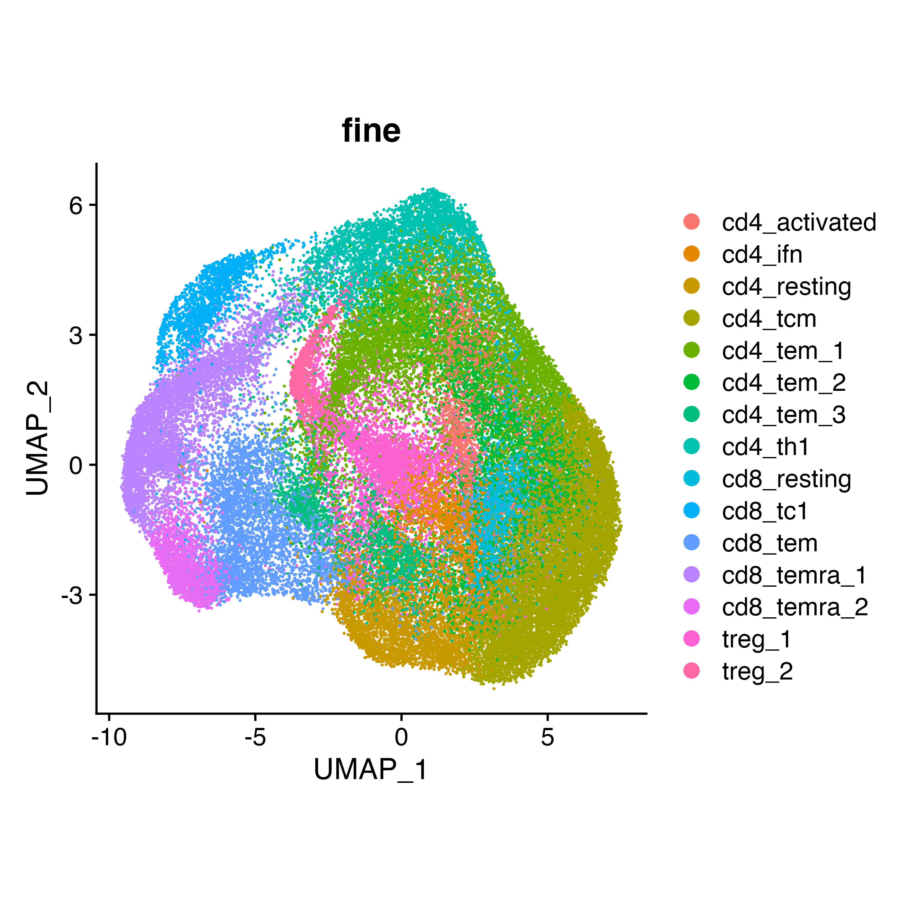
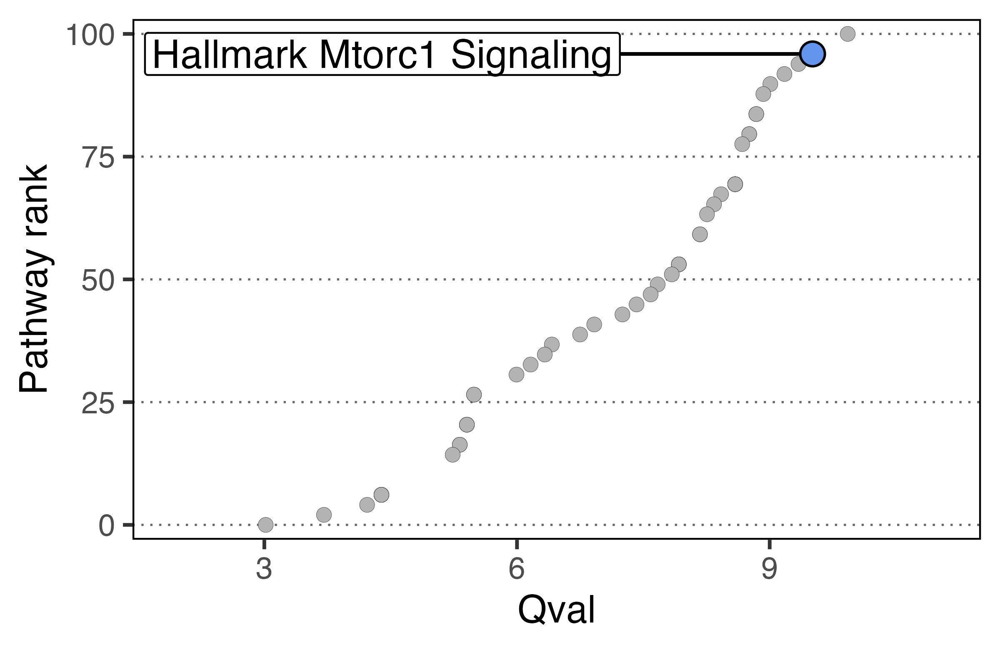

```{r, include = FALSE}
knitr::opts_chunk$set(
  collapse = TRUE,
  comment = "#>"
)
```

## 1. Broad overview of the workflow

```{r, eval=F}
pathways <- msigdbr("Homo sapiens", "H") %>%
  format_pathways()

# The populations here just need to be your normalized expression matrices

scpa_out <- compare_pathways(samples = list(population1, population2),
                             pathways = pathways)

# For faster analysis with parallel processing, use 'parallel = TRUE' and 'cores = x' arguments

```

In this output, the qval should be the primary metric that is used to interpret pathway differences i.e. a higher
qval translates to larger pathway differences between conditions.
If only two samples are provided, a fold change (FC) enrichment score will also be
calculated. A large advantage in assessing the multivariate distribution of a pathway in SCPA is that there will be pathways that show large qvals, but relatively small fold changes. These pathways
therefore show large differences that are independent of mean changes in gene expression. These are still highly relevant pathways, which we show in [our paper](https://www.cell.com/cell-reports/fulltext/S2211-1247(22)01571-6), and is why we suggest solely using the qval for
your statistical interpretation.

## 2. Full workflow on an example dataset

Here we're just going to show some general principles of what you need to get started in a basic pathway analysis. It acts as a quick reference to all the main points of the workflow, but more detailed examples can be found in our other tutorials.

### Basic information needed for pathway analysis
The two main bits of information we need are:

- Expression matrix for each condition (this can be formatted as separate data frames/matrices, or stored within a typical Seurat/SingleCellExperiment object)
- Gene sets

### Loading in packages 
For this simple example, we're going to load in a few packages. msigdbr allows access to a large number of gene sets that are collated [here](https://www.gsea-msigdb.org/gsea/msigdb/genesets.jsp)

```{r setup, results='hide', warning=F, message=F, eval=F}
library(SCPA)
library(msigdbr)
library(Seurat)
library(dplyr)
library(ggplot2)
```

### Loading in data
Here we're going to use data taken from the [Szabo, P... Sims, P](https://www.nature.com/articles/s41467-019-12464-3) paper. You can find this data in an R object [here](https://drive.google.com/file/d/1-HJHfSMw5EBP02ZjTrbX7Pd_5eYGe1Zz/view?usp=sharing)

```{r, eval=F}
t_cells <- readRDS("szabo_t_cell.rds")
```


### Quick Look at the data
```{r plot_umap, eval=F}
DimPlot(t_cells) +
  theme(aspect.ratio = 1)
```

{width=60%}


### Generating samples from a Seurat object
For this basic comparison, we're going to look at T helper 1 (Th1) and T central memory (Tcm) cells. To generate expression matrices that SCPA can use, we can run the `seurat_extract` function. This takes a Seurat object as an input, subsets data based on the Seurat column metadata, and returns an expression file for that given subset. If you have a SingleCellExperiment object, you can use the `sce_extract` function.

```{r extract_data, eval=F}
tcm <- seurat_extract(t_cells,
                      meta1 = "cell", value_meta1 = "cd4 tcm")
th1 <- seurat_extract(t_cells,
                      meta1 = "cell", value_meta1 = "cd4 th1")
```

### Generate some gene sets using msigdbr
We then need to generate our gene sets. msigdbr is a handy package
that allows you to get this information. Here we're pulling all the Hallmark pathways, and
using the `format_pathways` function within SPCA to get them properly formatted. A detailed explanation of
generating gene sets for SCPA can be found [here](https://jackbibby1.github.io/SCPA/articles/using_gene_sets.html)

```{r get_pathways, eval=F}
pathways <- msigdbr("Homo sapiens", "H") %>%
  format_pathways()
```

### Comparing samples
We're all set. We now have everything that we need to compare the two populations. So just run 
`compare_pathways` and use the objects we created above.

```{r compare_pathways, eval=F}
scpa_out <- compare_pathways(samples = list(tcm, th1), 
                             pathways = pathways)

# For faster analysis with parallel processing, use 'parallel = TRUE' and 'cores = x' arguments
```

```{r, echo=F}
scpa_out <- readRDS("../inst/rds_files/th1_tcm.rds")
```


And in `scpa_out`, we have all our results.

```{r lood_at_output}
head(scpa_out, 5)
```

### Plotting some basic output
You can use SCPA to generate a pathway rank plot. For example, we can highlight one of the topmost pathways -- MTORC1 -- using the `plot_rank` function.

```{r plot_rank, eval=F, dpi=600, out.width="50%"}
plot_rank(scpa_out = scpa_out, 
          pathway = "MTORC1", 
          base_point_size = 2, 
          highlight_point_size = 3)
```

{width=50%}


