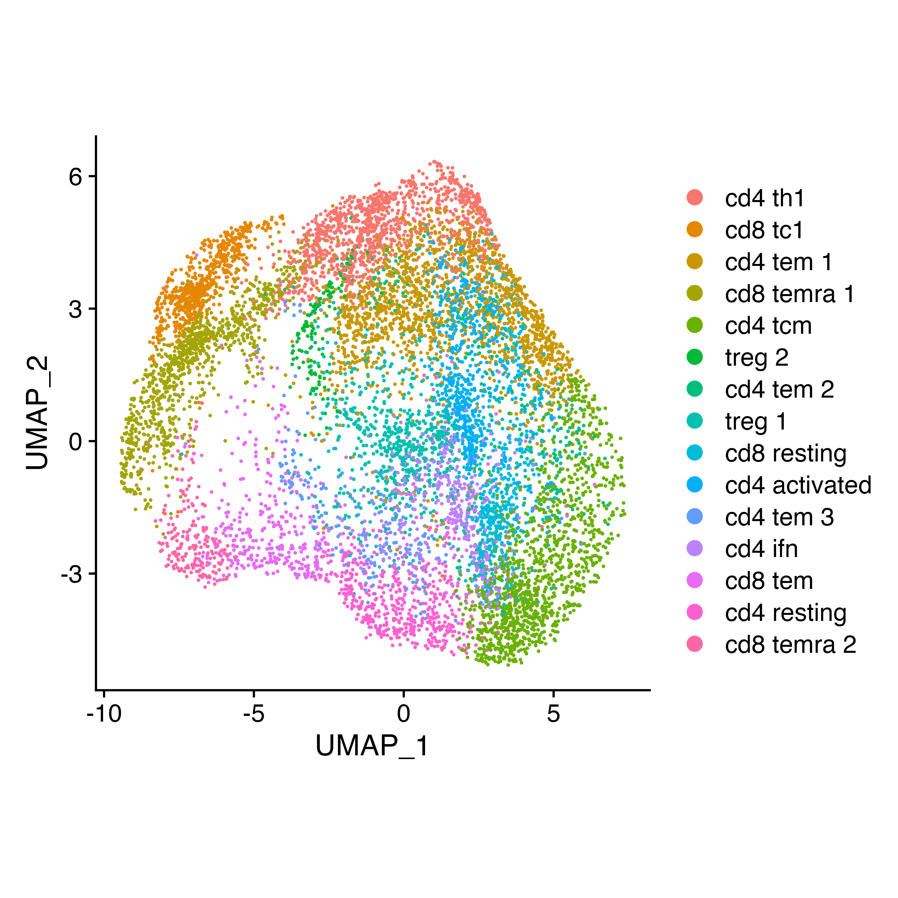

```{r, include = FALSE}
knitr::opts_chunk$set(
  collapse = TRUE,
  comment = "#>"
)
```

As well as importing expression matrices into `compare_pathways`, you can also compare populations directly within a Seurat or SingleCellExperiment object in one function within SCPA. To do this, you just need the Seurat/SCE object that is annotated with the groups you want to compare.

Let's load in a few packages.
```{r setup, eval=F}
library(SCPA)
library(tidyverse)
library(msigdbr)
library(Seurat)
```


### Getting the dataset
We're going to do the same comparison of Th1 and Tcm cells that we did in the [quick start tutorial](https://jackbibby1.github.io/SCPA/articles/quick_start.html), again using all Hallmark gene sets. We'll use the [Szabo, P... Sims, P](https://www.nature.com/articles/s41467-019-12464-3) T cell dataset that you can download [here](https://drive.google.com/file/d/1-HJHfSMw5EBP02ZjTrbX7Pd_5eYGe1Zz/view?usp=sharing).

```{r, eval=F}
t_cells <- readRDS("szabo_t_cell.rds")
```

### Quick Look at the data
```{r plot_umap, eval=F}
DimPlot(t_cells) +
  theme(aspect.ratio = 1)
```

{width=50%}

### Getting the gene sets
We need to define our gene sets, and we can do this through the msigdbr package that contains a bunch of biological gene sets that can be found [here](https://www.gsea-msigdb.org/gsea/msigdb/genesets.jsp). Here we just take the Hallmark gene sets (using the "H" call to msigdbr), and use the format_pathways function to get them in a readable format for SCPA.

```{r get_pathways, eval=F}
pathways <- msigdbr("Homo sapiens", "H") %>%
  format_pathways()
```


### SCPA comparison
Now to compare the Th1 and Tcm populations, we can use the compare_seurat function within SCPA. Here, `group1` defines the column name for your metadata, and `group1_population` defines two values within that column. N.B. We're going to compare populations within a Seurat object here, but it's the same set up for a SCE object using the `compare_sce` function.

```{r compare_pathways, eval=F}
scpa_out <- compare_seurat(t_cells,
                           group1 = "cell", 
                           group1_population = c("cd4 th1", "cd4 tcm"),
                           pathways = pathways)

# For faster analysis with parallel processing, use 'parallel = TRUE' and 'cores = x' arguments
```

And that's it. Your results will be stored in your `scpa_out` object.

### Comparing across more than 2 populations
If you wanted to compare more than 2 populations in a Seurat object e.g. multiple time points, you just need to supply more arguments to the `group1_population` call. For example, on a hypothetical dataset:

```{r multiple_comparisons, eval=F}
scpa_out <- compare_seurat(different_dataset,
                           group1 = "hour", 
                           group1_population = c("0", "12", "24"),
                           group2 = "cell",
                           group2_population = "t_cells"
                           pathways = pathways)

# For faster analysis with parallel processing, use 'parallel = TRUE' and 'cores = x' arguments

```


