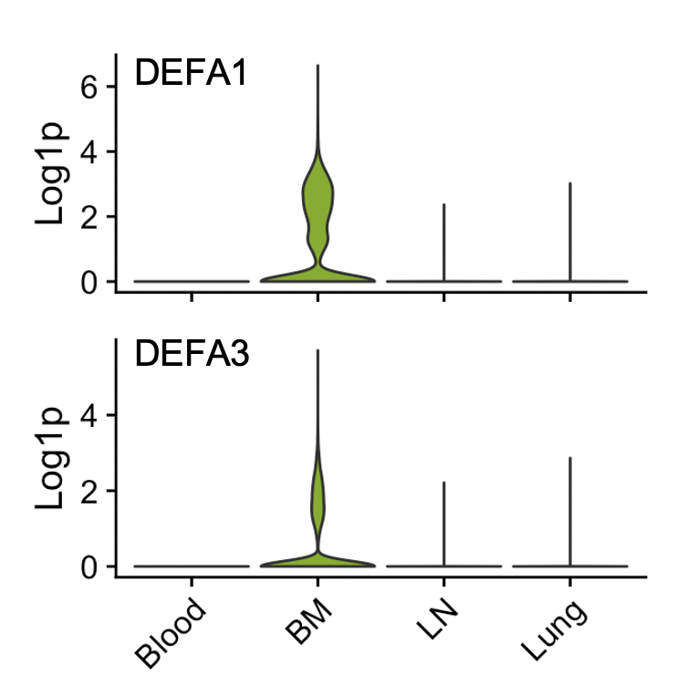

```{r, include = FALSE}
knitr::opts_chunk$set(
  collapse = TRUE,
  comment = "#>"
)
```

Here we're going to use SCPA to do a more systems level analysis of T cell gene set perturbations across many cell types and multiple tissues. For the analysis, we're using data from [this paper](https://www.nature.com/articles/s41467-019-12464-3) by Szabo, P... Sims, P. In their protocol they sorted CD3^+^ T cells from the blood, bone marrow, lymph node, and lung, and either left them unstimulated, or stimulated the cells for 16 hours. You can download the dataset [here](https://drive.google.com/file/d/1-HJHfSMw5EBP02ZjTrbX7Pd_5eYGe1Zz/view?usp=sharing)

### Loading in packages and data
So first let's load in a few packages
```{r setup, eval=F}
library(SCPA)
library(Seurat)
library(msigdbr)
library(magrittr)
library(tidyverse)
library(ComplexHeatmap)
```

And load in the dataset

```{r, eval=F}
tissue_data <- readRDS("szabo_t_cell.rds")
```

### Quick look at the data
Let's have a quick look at the data

```{r, eval=F}
DimPlot(tissue_data, split.by = "tis_stim", group.by = "fine", ncol = 4)
```

{width=100%}


### Defining gene sets to analyse
Now we're going to define all the pathways that we want to use. For this analysis we're going to use a bunch of different gene sets that include many of the canonical pathways listed on the [MSigDB website](https://www.gsea-msigdb.org/gsea/msigdb/genesets.jsp). In total, this list contains around 3000 pathways.

```{r, eval=F}
pws <- c("kegg", "reactome", "biocarta", "wiki", "pid")
pathways <- msigdbr("Homo sapiens") %>%
  filter(grepl(paste(pws, collapse = "|"), gs_subcat, ignore.case = T) |
           grepl("HALLMARK", x = gs_name, ignore.case = T)) %>%
  format_pathways()
```


### Small bit of data prep
For this analysis we want to keep blood T cells as a reference, and understand what happens to T cells when they migrate into the respective tissues; either the bone marrow, lymph node, or lung.

First we need to define our cell types that we want to analyse. We're going to compare every cell type across the tissues, so we can just pull this from the metadata of the Seurat object.

```{r define_cell_types, eval=F}
cell_types <- unique(tissue_data$fine)
```

We're also going to split the Seurat object by tissue to make the comparisons easier. This will make a list of Seurat objects that are split by tissue site

```{r split_object, eval=F}
split_tissue <- SplitObject(tissue_data, split.by = "tissue")
```

### Pathway analysis across tissues
Now we just need to create a loop that will cycle over all the cell types for each tissue and extract their expression values, before doing the pathway analysis. Just to break this down a bit:

Given the number of cells, pathways, and samples we're comparing, this may take a while. Here we're showing how to run a comparison sequentially, but you can significantly reduce the time taken for the analysis if you split the three comparisons across e.g. different scripts.

```{r compare_pathways, eval=F}
# We first create empty lists to store results from the for loop
bl_bm <- list(); bl_ln <- list(); bl_lung <- list()
for (i in cell_types) {
  
  # We extract expression data using `seurat_extract` based on tissue, cell_type ("fine"), and stimulation ("none")
  blood <- seurat_extract(split_tissue$bl, 
                          meta1 = "fine", value_meta1 = i,
                          meta2 = "stimulation", value_meta2 = "none")
  
  bm <- seurat_extract(split_tissue$bm, 
                       meta1 = "fine", value_meta1 = i,
                       meta2 = "stimulation", value_meta2 = "none")
  
  ln <- seurat_extract(split_tissue$ln, 
                       meta1 = "fine", value_meta1 = i,
                       meta2 = "stimulation", value_meta2 = "none")
  
  lung <- seurat_extract(split_tissue$lung, 
                         meta1 = "fine", value_meta1 = i,
                         meta2 = "stimulation", value_meta2 = "none")
  
  # We then compare all tissues to the blood using `compare_pathways`
  print(paste("comparing", i))
  bl_bm[[i]] <- compare_pathways(list(blood, bm), pathways)
  bl_ln[[i]] <- compare_pathways(list(blood, ln), pathways)
  bl_lung[[i]] <- compare_pathways(list(blood, lung), pathways)
  
# For faster analysis with parallel processing, use 'parallel = TRUE' and 'cores = x' arguments
  
}
```

### Extracting all the useful information for plotting
That's it -- we have the results. Above we only showed the unstimulated analysis, but we did the same comparison, only changing the `meta2 = "stimulation", value_meta2 = "none"` to `meta2 = "stimulation", value_meta2 = "stim"` to get the pathway analysis done on the stimulated cells. Now we just need to extract the results in a sensible way to plot the data.

<details>
  <summary>**Click here for the data wrangling for plotting**</summary>
  
For the extraction, we can do something like the below, which extracts the pathway name and qval for each comparison, and assigns a column name that adds the tissue of each cell type comparison to the column name

```{r, eval=F}
get_qvals <- function(scpa_out, name) {
  
  df <- list()
  for (i in names(scpa_out)) {
    df[[i]] <- scpa_out[[i]] %>%
      select(Pathway, qval)
  }
  
  col_names <- names(df)
  for (i in 1:length(df)) {
    df[[i]] <- set_colnames(df[[i]], c("pathway", paste(name, col_names[[i]], sep = "_")))
  }
  
  return(df)
  
}
```

And now we can use this function to format all the comparisons into a single data frame
```{r, eval=F}
scpa_results <- Reduce(full_join, c(get_qvals(bl_bm, "bm"),
                                    get_qvals(bl_ln, "ln"),
                                    get_qvals(bl_lung, "lung")))
```

Here we're just combining the unstimulated and stimulated conditions, and then extracting information from the column names to be used in the heatmap. We're also defining a heatmap annotation that will add tiles above the heatmap.
```{r, eval=F}
pway_rest <- pway_rest %>%
   column_to_rownames("pathway") %>%
   set_colnames(paste("rest", colnames(.), sep = "_")) %>%
   rownames_to_column("pathway")

pway_act <- pway_act %>%
   column_to_rownames("pathway") %>%
   set_colnames(paste("stim", colnames(.), sep = "_")) %>%
   rownames_to_column("pathway")

all_data <- full_join(pway_rest, pway_act, "pathway") %>%
  column_to_rownames("pathway")

stim <- all_data %>%
  colnames() %>%
  substr(1, 4) %>%
  str_to_sentence()

tissue <- colnames(all_data) %>%
  substr(6, 9) %>%
  sub(pattern = "_[a-z]", replacement = "") %>%
  gsub(pattern = "bm", replacement = "BM") %>%
  gsub(pattern = "ln", replacement = "LN") %>%
  gsub(pattern = "lung", replacement = "Lung")

lineage <- colnames(all_data) %>%
  str_extract(pattern = "cd[48]") %>%
  str_to_upper() %>%
  replace_na("CD4")

col_an <- HeatmapAnnotation(Stimulation = stim,
                            Tissue = tissue,
                            Lineage = lineage,
                            col = list(Stimulation = c("Rest" = "gray70", "Stim" = "orangered2"),
                                       Tissue = c("BM" = "#cccccc", "LN" = "#be83e6", "Lung" = "#84c476"),
                                       Lineage = c("CD4" = "#4589ff", "CD8" = "#ff6363")),
                            gp = gpar(col = "white", lwd = 0.05),
                            annotation_name_gp = gpar(fontsize = 9),
                            simple_anno_size = unit(3, "mm"))


```
</details>
\

### Plotting a global summary of the data
We can now plot a broad summary using the qvals from each comparison. For this, we're just going to represent the data in a heatmap, using the great [ComplexHeatmap](https://jokergoo.github.io/ComplexHeatmap-reference/book/) package.
```{r, eval=F}
hm <- all_data %>%
  Heatmap(name = "Qval",
          show_row_names = F, 
          top_annotation = col_an,
          border = T,
          show_row_dend = F,
          show_column_dend = F,
          show_column_names = F)

ht <- draw(hm)
```

{width=60%}

### Finding something a bit more specific
You obviously now want to use this data to find something a bit more biologically relevant. One way to do this would be to see if any pathways were tissue specific. To do this, we calculated the most variable pathways across comparisons, and then plotted the variance against the pathway (pathway names added later). Here we can see signatures for antimicrobial peptide production and prostaglandin synthesis at highly variable across conditions.

```{r, eval=F}
apply(all_data, 1, var) %>%
  data.frame() %>% 
  set_colnames("variance") %>%
  arrange(desc(variance)) %>% 
  rownames_to_column("pathway") %>%
  ggplot(aes(reorder(pathway, variance), variance)) +
  geom_point(shape = 21, cex = 3, fill = "royalblue2", color = 'black', stroke = 0.2) +
  scale_x_discrete(expand = c(0.04, 0.04)) +
  labs(x = "Pathway", y = "Variance") +
  theme(axis.text.x = element_blank(),
        axis.ticks.x = element_blank(),
        panel.background = element_blank(),
        panel.border = element_rect(fill = NA))
```

{width=30%}


### Highlighting genes from the antimicrobial pathway
And after going back to the pathway gene expression, and filtering genes that showed little or no
expression, we can see that this pathway signature was mainly driven by expression of alpha defensin proteins, exclusively in T cells from the bone marrow. Here are these alpha defensin genes by tissue:

```{r, eval=F}
tissue_data$neat <- case_when(tissue_data$tissue == "bl" ~ "Blood",
                              tissue_data$tissue == "bm" ~ "BM",
                              tissue_data$tissue == "lung" ~ "Lung",
                              tissue_data$tissue == "ln" ~ "LN")

plots <- VlnPlot(df, c("DEFA1", "DEFA3"), pt.size = 0, group.by = "neat", ncol = 1, combine = F)

p1 <- VlnPlot(df, "DEFA1", pt.size = 0, group.by = "neat", ncol = 1) +
  theme(axis.text.x = element_blank(),
        axis.title.x = element_blank(),
        plot.title = element_blank()) + 
  NoLegend() +
  ylab("Log1p")

p2 <- VlnPlot(df, "DEFA3", pt.size = 0, group.by = "neat", ncol = 1) +
  theme(axis.title.x = element_blank(),
        plot.title = element_blank()) + 
  NoLegend() +
  ylab("Log1p")

patchwork::wrap_plots(p1, p2, ncol = 1)
```


{width=40%}


