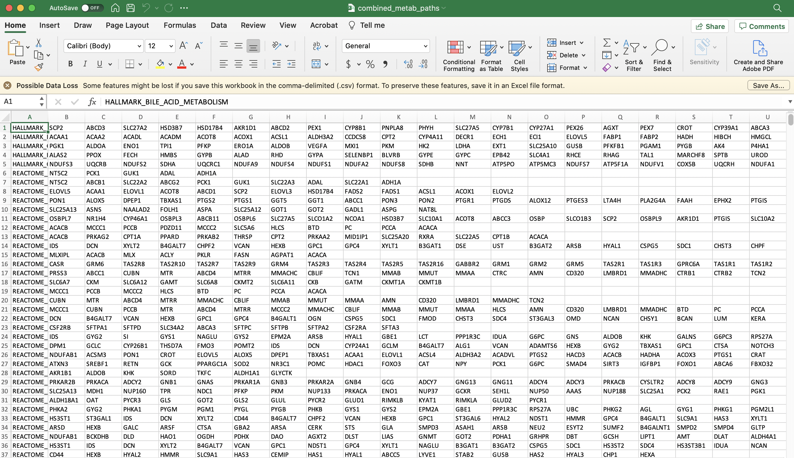

```{r, include = FALSE}
knitr::opts_chunk$set(
  collapse = TRUE,
  comment = "#>"
)
```

## Using gene sets in SCPA
There are a few different formats for gene sets that you can use in SCPA

- Generate gene set lists in R (possibly the best option)
- Use a classical gene set gmt file
- Use a csv file

Here we'll outline a basic workflow to get gene sets using either of the methods. First let's load in a couple of packages we'll need

```{r setup}
library(SCPA)
library(msigdbr)
```


## 1. Generating gene sets within R using msigdbr

### Generic example
In a simple example, you can generate formatted gene sets using two simple lines of code. We'll just extract all the Hallmark pathways from msigdbr

```{r, eval=F}
pathways <- msigdbr(species = "Homo sapiens", category = "H") %>%
      format_pathways()
```

### More detailed example
msigdbr is a handy R package that contains a large number of pathways. You can see
a detailed explanation of how to use different aspects of the package in the 
[msigdbr vignette](https://cran.r-project.org/web/packages/msigdbr/vignettes/msigdbr-intro.html).
We're going to use it to generate lists of gene sets that we want to analyse in our data using SCPA.

For example, we can generate a data frame containing all of the Homo sapiens
Hallmark gene sets using the "H" call within `msigdbr`. This data is in tidy format
with all the pathway names in the gs_name category, and gene names in the gene_symbol
category

```{r}
hallmark <- msigdbr("Homo sapiens", "H")
head(hallmark)

```

We can have a look at a few of these pathways

```{r}
hallmark$gs_name %>% 
  unique() %>%
  head(10)

```

We only really need the pathway name and gene symbol though. For SCPA, we also need it to be formatted
into separate lists for each pathway. We can do this easily using the `format_pathways` function
within SCPA

```{r}
hallmark <- format_pathways(hallmark)
```

This will result in a list of pathways and all the genes of that pathway. We can see this if we just look at the first element of the pathway list

```{r}
head(hallmark[[1]])
```

Now we've generated pathways that can be analysed directly in the `compare_pathways` function of SCPA


### Versatility in using msigdbr
An advantage of using something like msigdbr is its versatility in subsetting specific pathways,
or collection of gene sets. For example, if we wanted all pathways related to interferon, 
we could use grepl to filter the gs_names column:

```{r, eval=F}
ifn_pathways <- msigdbr("Homo sapiens") %>%
  filter(grepl("interferon", gs_name, ignore.case = T)) %>%
  format_pathways()
```

Or we could specify a combination of collections so we get all of the Hallmark,
KEGG, and Reactome gene sets:

```{r, eval=F}
pathways <- c("hallmark", "kegg", "reactome")
hkr_sets <- msigdbr("Homo sapiens") %>%
  filter(grepl(paste(pathways, collapse = "|"), gs_name, ignore.case = T)) %>%
  format_pathways()
```

Using something like this makes it easy to pull large and/or relevant gene set lists for direct use within SCPA.

## 2. Using a gmt file
SCPA has a built in function to read gmt files and format them properly. All you need to do is specify the filepath.

```{r, eval=F}
pathways <- "path/to/geneset/file.gmt"
```

And then you can just use this in the `compare_pathways` function

```{r, eval=F}
scpa_out <- compare_pathways(samples = samples, pathways = pathways)
```


## 3. Using a csv file
In this example, we need to create the csv file, but once that's done,
it's a simple line of code. As with gmt files, SCPA can directly read properly formatted
csv gene set files -- you just need to supply the filepath

```{r, eval=F}
pathways <- "path/to/geneset/file.csv"
scpa_out <- compare_pathways(samples = samples, pathways = pathways)
```

### How to create the csv file
The csv file needs to be formatted in the style of a classical
gene set gmt file. This being the pathway name in column 1, and genes of that pathway in subsequent
columns. To generate something like this, all you need to do is download a gmt file, open it in something like excel, delete the second column containing a url, and save it as a csv file. Using this method means you can manually create a list of gene sets you're interested in, where you're not limited to existing databases. The file should look something like this:

{width=100%}


