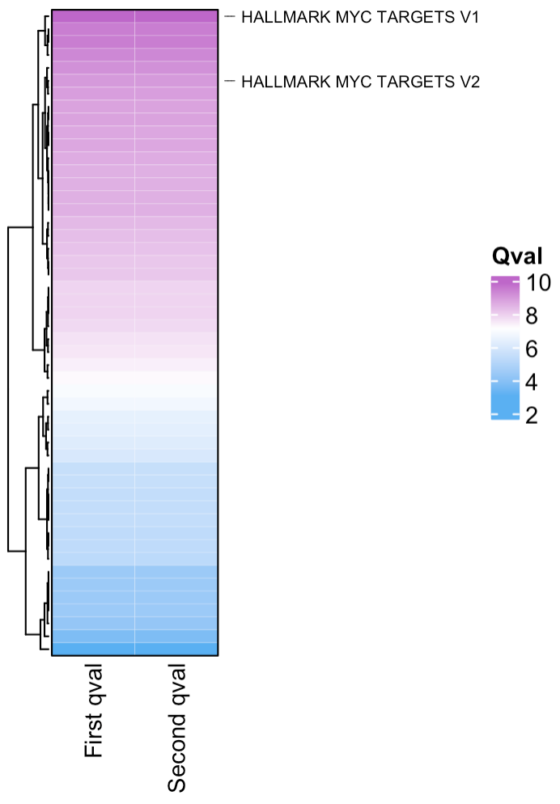

```{r, include = FALSE}
knitr::opts_chunk$set(
  collapse = TRUE,
  comment = "#>"
)
```

## Visualising the output from SCPA

Visualising the output from SCPA is best done by considering the relative ranks of the qvals.
This will give you the best chance to find the most appropriate signal.

```{r, include=FALSE}
scpa_out <- readRDS("~/Google Drive/r_packages/SCPA/rds_files/th1_tcm.rds")
```

Lets load in some packages
```{r setup, warning=FALSE, message=FALSE}
library(SCPA)
library(tidyverse)
library(ComplexHeatmap)
```

We can use data from the comparison we did in the 
[quick start](https://jackbibby1.github.io/SCPA/articles/quick_start.html) 
tutorial where we compared Th1 and Tcm cells. You can get this rds file [here](https://github.com/jackbibby1/SCPA/tree/main/rds_files).

```{r, eval=FALSE}
scpa_out <- readRDS("th1_tcm.rds")
```

`scpa_out` is the standard output from a two sample SCPA comparison:

```{r}
head(scpa_out)
```


## 1. A simple rank plot
We can use the `plot_rank` function in SCPA to plot the rank of a specific
pathway (or pathways) that we want to highlight. By default, this looks for a `qval` and `Pathway`
column, which is standard in the SCPA output. 

If you have your own data frame that contains all your qvals and a Pathway column, 
you can specify the column you want on the y axis with the
`population_name = [your_qval_column_name]` argument.
See `?plot_rank` for all the graphical parameters, but this is a ggplot object, so you can modify it using
the typical arguments e.g. `+ theme(panel.background...)`.

```{r, eval=FALSE}
# if you want all pathways that contain "MYC"...
p1 <- plot_rank(scpa_out, "myc", 
                highlight_point_size = 3.5, highlight_point_color = "#60c5f7")

# or if you want a specific myc pathway...
p2 <- plot_rank(scpa_out, "HALLMARK_MYC_TARGETS_V1",
                highlight_point_size = 3.5, highlight_point_color = "#fa815c")

patchwork::wrap_plots(p1, p2)

```

{width=80%}

## 2. Plotting a heatmap of results
You can use the `plot_heatmap` option within SCPA to visualise the output, which uses the great
[ComplexHeatmap](https://github.com/jokergoo/ComplexHeatmap) package. Like the
`plot_rank` function, you can choose to highlight general or specific pathways. By default, this function
looks for any column names that contain "qval", and uses them to plot the heatmap. This means you can combine
muliple SCPA results into a single heatmap. See `?plot_heatmap` for graphical parameters.


```{r, warning=FALSE, eval=FALSE}
plot_heatmap(scpa_out, 
             highlight_pathways = "myc",
             column_names = "Th1 vs Tcm",
             show_row_names = F)
```

{width=40%}

If you want to combine multiple scpa outputs into a single heatmap, you can add
your qvals into a single data frame. You just need to make sure the column you're
adding contains "qval" in its name e.g.

```{r, warning=FALSE, eval=FALSE}
# here we'll just duplicate the qval column for the purpose of this example
scpa_out %>%
  mutate(another_qval = qval) %>%
  plot_heatmap(highlight_pathways = "myc",
               hm_colors = c("#5ab0f2", "white", "#be67c9"),
               column_names = c("First qval", "Second qval"),
               cluster_columns = F,
               show_row_names = F)
```

{width=50%}


